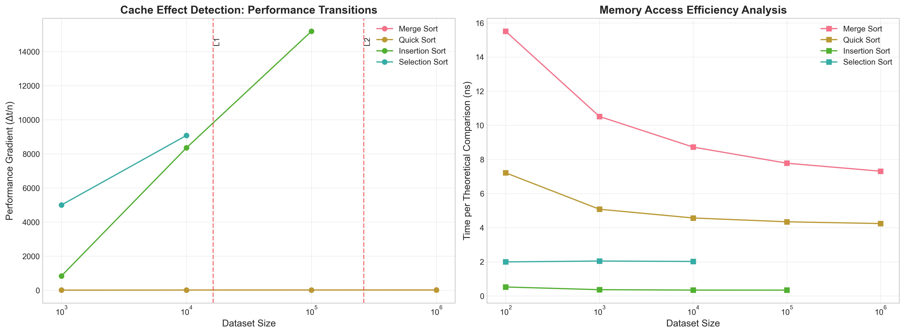

# Compare Sorting Alrgorithms

**NOTE**: This is a **simple** project to compare the performance of different sorting algorithms in C++ for writing in
SKKU
English Writing(GEDG001) class

## HOW TO RUN

1. Clone the repository
   ```bash
   git clone https://github.com/BetaTester772/comapreSortingAlgorithm
   cd comapreSortingAlgorithm
    ```
2. Install dependencies
   ```bash
   sudo apt install python3 g++
   curl -LsSf https://astral.sh/uv/install.sh | sh
   uv sync
   ```
3. Run the main script
   ```bash
   uv run main.py
   ```
   or
    ```bash
    uv run monitor.py
    ```

**Note**: If you want to get test_datasets_full.txt, you can just use `git clone` command. But, sometimes, you must use
`git-lfs` and run `git lfs pull` after cloning the repository. Here is the link to
the [git-lfs](https://git-lfs.github.com/) if you don't have it installed.

## SORTING ALGORITHMS

- Insertion Sort
- Selection Sort
- Merge Sort
- Quick Sort

## TEST PROPERTIES

- **Data size**: 100, 1000, 10000, 100000, 1000000
- **Data type**: Random, Sorted, Reversed
- **iterations**: 100

## TEST ENVIRONMENT

- **CPT**: VM.Standard.A1.flex
- **OS**: Ubuntu 24.04
- **GCC**: 13.3.0

## [TEST RESULTS]([monitor_py_output.txt](result/monitor_py_output.txt))

full log of [monitor.py](monitor.py) is available in [out.log](out.log)

### STATISTICAL ANALYSIS USING PANDAS

#### 1. Overall Performance Statistics (microseconds)

| algorithm       | mean      | std       | min  | max        |
|-----------------|-----------|-----------|------|------------|
| insertion\_sort | 145083.93 | 486169.44 | 0.19 | 1688528.32 |
| merge\_sort     | 23047.44  | 44534.51  | 8.64 | 145679.01  |
| quick\_sort     | 13110.24  | 25592.62  | 4.70 | 84526.54   |
| selection\_sort | 34081.20  | 50352.03  | 8.99 | 101862.37  |

#### 2. Performance by Dataset Size (nanoseconds)

| size    | insertion\_sort | merge\_sort | quick\_sort | selection\_sort |
|---------|-----------------|-------------|-------------|-----------------|
| 100     | 2432.0          | 9241.0      | 4742.0      | 9379.0          |
| 1000    | 180666.0        | 83195.0     | 39624.0     | 1020605.0       |
| 10000   | 16933016.0      | 880593.0    | 454963.0    | 101213615.0     |
| 100000  | 844315291.0     | 9488956.0   | 5217884.0   | NaN             |
| 1000000 | 1028272.0       | 104775201.0 | 59834004.0  | NaN             |

#### 3. Performance by Data Distribution (nanoseconds)

| distribution    | insertion\_sort | merge\_sort | quick\_sort | selection\_sort |
|-----------------|-----------------|-------------|-------------|-----------------|
| random          | 426425462.0     | 31974100.0  | 18480510.0  | 34008842.0      |
| reverse\_sorted | 11387527.0      | 18442566.0  | 10763223.0  | 34299191.0      |
| sorted          | 228554.0        | 18725646.0  | 10086997.0  | 33935566.0      |

#### 4. Best Algorithm by Condition

**Dataset Size: 100**

* random         : insertion\_sort (2.6 μs)
* reverse\_sorted : insertion\_sort (4.5 μs)
* sorted         : insertion\_sort (186 ns)

**Dataset Size: 1,000**

* random         : quick\_sort (50.6 μs)
* reverse\_sorted : quick\_sort (36.0 μs)
* sorted         : insertion\_sort (1.1 μs)

**Dataset Size: 10,000**

* random         : quick\_sort (606.9 μs)
* reverse\_sorted : quick\_sort (390.1 μs)
* sorted         : insertion\_sort (11.0 μs)

**Dataset Size: 100,000**

* random         : quick\_sort (7.21 ms)
* reverse\_sorted : quick\_sort (4.37 ms)
* sorted         : insertion\_sort (102.3 μs)

**Dataset Size: 1,000,000**

* random         : quick\_sort (84.53 ms)
* reverse\_sorted : quick\_sort (49.01 ms)
* sorted         : insertion\_sort (1.03 ms)

#### 5. Speedup Analysis (vs Selection Sort baseline)

**Dataset Size: 100** (baseline: 9.4 μs)

* insertion\_sort : 3.86x
* merge\_sort     : 1.01x
* quick\_sort     : 1.98x

**Dataset Size: 1,000** (baseline: 1020.6 μs)

* insertion\_sort : 5.65x
* merge\_sort     : 12.27x
* quick\_sort     : 25.76x

**Dataset Size: 10,000** (baseline: 101213.6 μs)

* insertion\_sort : 5.98x
* merge\_sort     : 114.94x
* quick\_sort     : 222.47x

---

### PERFORMANCE SUMMARY TABLE (Average Time in Nanoseconds)

| size    | distribution    | insertion\_sort | merge\_sort | quick\_sort | selection\_sort |
|---------|-----------------|-----------------|-------------|-------------|-----------------|
| 100     | random          | 2609.0          | 10302.0     | 4792.0      | 9965.0          |
|         | reverse\_sorted | 4500.0          | 8644.0      | 4696.0      | 9178.0          |
|         | sorted          | 186.0           | 8778.0      | 4739.0      | 8994.0          |
| 1000    | random          | 182116.0        | 104817.0    | 50620.0     | 1021615.0       |
|         | reverse\_sorted | 358799.0        | 72760.0     | 35977.0     | 1026028.0       |
|         | sorted          | 1084.0          | 72008.0     | 32273.0     | 1014171.0       |
| 10000   | random          | 16988800.0      | 1158852.0   | 606880.0    | 100994945.0     |
|         | reverse\_sorted | 33799280.0      | 736813.0    | 390073.0    | 101862366.0     |
|         | sorted          | 10967.0         | 746113.0    | 367935.0    | 100783533.0     |
| 100000  | random          | 1688528000.0    | 12917521.0  | 7213715.0   | NaN             |
|         | reverse\_sorted | NaN             | 7723883.0   | 4371059.0   | NaN             |
|         | sorted          | 102259.0        | 7825465.0   | 4068878.0   | NaN             |
| 1000000 | random          | NaN             | 145679010.0 | 84526543.0  | NaN             |
|         | reverse\_sorted | NaN             | 83670727.0  | 49014308.0  | NaN             |
|         | sorted          | 1028272.0       | 84975867.0  | 45961162.0  | NaN             |

---

### SORTING ALGORITHM PERFORMANCE SUMMARY

#### Dataset Size: 100 elements

**Random**

1. insertion\_sort 0.003 ms
2. quick\_sort 0.005 ms
3. selection\_sort 0.010 ms
4. merge\_sort 0.010 ms

**Sorted**

1. insertion\_sort 0.000 ms
2. quick\_sort 0.005 ms
3. merge\_sort 0.009 ms
4. selection\_sort 0.009 ms

**Reverse Sorted**

1. insertion\_sort 0.004 ms
2. quick\_sort 0.005 ms
3. merge\_sort 0.009 ms
4. selection\_sort 0.009 ms

#### Dataset Size: 1,000 elements

**Random**

1. quick\_sort 0.051 ms
2. merge\_sort 0.105 ms
3. insertion\_sort 0.182 ms
4. selection\_sort 1.022 ms

**Sorted**

1. insertion\_sort 0.001 ms
2. quick\_sort 0.032 ms
3. merge\_sort 0.072 ms
4. selection\_sort 1.014 ms

**Reverse Sorted**

1. quick\_sort 0.036 ms
2. merge\_sort 0.073 ms
3. insertion\_sort 0.359 ms
4. selection\_sort 1.026 ms

#### Dataset Size: 10,000 elements

**Random**

1. quick\_sort 0.607 ms
2. merge\_sort 1.159 ms
3. insertion\_sort 16.989 ms
4. selection\_sort 100.995 ms

**Sorted**

1. insertion\_sort 0.011 ms
2. quick\_sort 0.368 ms
3. merge\_sort 0.746 ms
4. selection\_sort 100.784 ms

**Reverse Sorted**

1. quick\_sort 0.390 ms
2. merge\_sort 0.737 ms
3. insertion\_sort 33.799 ms
4. selection\_sort 101.862 ms

#### Dataset Size: 100,000 elements

**Random**

1. quick\_sort 7.214 ms
2. merge\_sort 12.918 ms
3. insertion\_sort 1688.528 ms

**Sorted**

1. insertion\_sort 0.102 ms
2. quick\_sort 4.069 ms
3. merge\_sort 7.825 ms

**Reverse Sorted**

1. quick\_sort 4.371 ms
2. merge\_sort 7.724 ms

#### Dataset Size: 1,000,000 elements

**Random**

1. quick\_sort 84.527 ms
2. merge\_sort 145.679 ms

**Sorted**

1. insertion\_sort 1.028 ms
2. quick\_sort 45.961 ms
3. merge\_sort 84.976 ms

**Reverse Sorted**

1. quick\_sort 49.014 ms
2. merge\_sort 83.671 ms

---

## [TEST ANALYSIS](result/analysis_py_output.txt)

### THEORY VS PRACTICE: EMPIRICAL COMPLEXITY ANALYSIS


#### Complexity Analysis Summary

| Algorithm       | Theoretical | Empirical | Gap  | R²     | Constant Factor |
|-----------------|-------------|-----------|------|--------|-----------------|
| merge\_sort     | O(n^1.0)    | O(n^1.04) | 3.9% | 0.9999 | 8.27e+01        |
| quick\_sort     | O(n^1.0)    | O(n^1.06) | 6.5% | 0.9999 | 3.40e+01        |
| insertion\_sort | O(n^2.0)    | O(n^1.94) | 3.0% | 0.9997 | 3.11e-01        |
| selection\_sort | O(n^2.0)    | O(n^2.00) | 0.1% | 1.0000 | 9.89e-01        |

---

### CACHE EFFECTS AND MEMORY LOCALITY ANALYSIS



#### Cache Efficiency Summary

| Algorithm       | Efficiency Degradation | Type           |
|-----------------|------------------------|----------------|
| merge\_sort     | -42.0%                 | Cache-friendly |
| quick\_sort     | -30.2%                 | Cache-friendly |
| insertion\_sort | -23.8%                 | Cache-friendly |
| selection\_sort | NaN                    | Cache-friendly |

---

### PRACTICAL PERFORMANCE ZONES FOR ALGORITHM SELECTION


---

### COMPILER OPTIMIZATION IMPACT ANALYSIS


#### Compiler Optimization Effectiveness

| Algorithm       | Scaling Efficiency | Comment        |
|-----------------|--------------------|----------------|
| insertion\_sort | 117.02%            | Well optimized |
| merge\_sort     | 121.64%            | Well optimized |
| quick\_sort     | 115.19%            | Well optimized |
| selection\_sort | 99.35%             | Well optimized |

---

### GENERATING RESEARCH-ORIENTED ANALYSIS REPORT

* Report: [research_analysis_report.md](result/research_analysis_report.md)
* LaTeX tables: [latex_tables](result/latex_tables)
